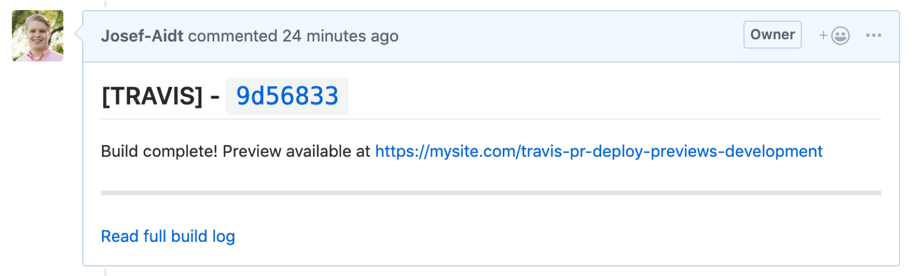

# Travis PR Deploy Previews



## Pipeline Details

### Production Branch

1. Developer commits code to `master`, either directly or via merge
2. Travis installs dependencies and runs build command
3. Travis enters deploy stage, uploads files that are newer than what exists on server
4. Travis sets appropriate permissions (`chmod 775`) to all files
5. Travis exits

### PR Deploy Previews

1. Developer commits code to branch other than `master`
2. Developer opens a pull request
3. Travis installs deps and runs build command
4. Travis build command recognizes this is a PR
5. Travis runs Node.js script, `pullrequest.js` to deploy
6. Script uses same upload functionality as production; uploads only newer files, sets permissions appropriately
     a. **NOTE**: Travis does not enter the deploy stage for PR's
     b. **NOTE**: Script creates a _sibling directory_ following the naming convention `{BUILD_NAME || repo name}-{branchname}` (for example, a PR comparing `development` to `master` (without supplying a build name) will create `travis-pr-deploy-previews-development`
7. Script comments on PR with build details

#### Directory Structure

```shell
| my-site
| -- index.html
| -- style.css
| my-site-development
| -- index.html
| -- style.css
| -- feature.js
```

#### Caveats

- Travis does not enter deploy stage for PR's, thus the need to custom script
    - script is needed for PR deploy previews on every Travis-enabled site
- PR Deploys create sibling directories, but _does not_ clean up these directories after merging; **this needs to be done manually**

## Note

For the build log link in PR deploy preview comments, the Travis app host URL is hardcoded. This will need to be manually updated.

```js
// scripts/pullrequest.js#L74
// update `travis.app.com`
const buildUrl = `https://travis.app.com/${TRAVIS_REPO_SLUG}/builds/${buildNum}`
```
